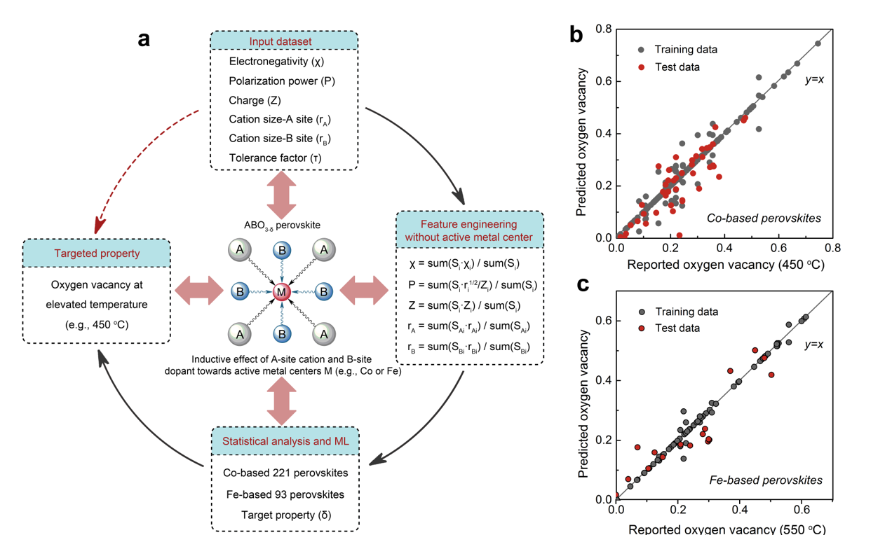

# MLtoolbox for Predicting Oxygen Vacancy of Perovskite

Source code and datasets for the submission of 'Rational design of metal oxides to reduce oxygen at intermediate temperatures'

Zhiheng Li, Xin Mao, Xiaoyong Xu*, Mengran Li*, Yadan Luo*, Linzhou Zhuang, Rijia Lin, Desheng Feng, Tianjiu Zhu, Fengli Liang, Helen Huang, Ateeq Ur Rehman, Muhammad Shirjeel Khan, Dong Liu, Zifeng Yan, Aijun Du, Zongping Shao* and Zhonghua Zhu*

## Abstract
Slow kinetics of oxygen reduction reaction limit the efficiency of many energy conversion and storage systems such as fuel cells and batteries. Pursuing efficient catalysts is paramount to accelerate this process but extremely challenging due to the lack of rationality particularly for oxygen reduction that involves both oxygen-ion surface exchange and bulk diffusion at elevated temperatures, which is drastically different from most of the near-room-temperature catalysis dominated only by the catalyst surfaces. Here we show that the cation-cation inductive interactions that commonly exist in the mixed metal oxides determine the oxygen vacancies of more than 200 state-of-the-art catalysts, which can be well predicted from machine learning based on the lattice cationic environment, requiring no heavy computational and experimental inputs. Our results demonstrate the important role of balancing oxygen vacancy formation and ion transport in the rational catalyst design, which contributes to the discovery of new perovskite oxides that show notably high reactivity and stability to reduce oxygen and consequently enables a solid oxide fuel cell to operate efficiently and stably at below 500 °C. We anticipate our work to be a starting point for a paradigm shift towards more rational development of new mixed metal oxides for efficient energy conversion and storage.

----
## Contents
* [Requirements](#requirements)
* [Datasets](#datasets)
* [Demo](#demo)
<!--   * [Video Demo](#video-demo) -->
* [Citation](#citation)
* [Contact](#contact)

## Requirements
- Python 3.6
- Then install all the library with: `pip install -r requirement.txt`

### Datasets
To reproduce the results for oxygen vacancy prediction, we have prepared a cleaned version of data files:
- `data_Co.xlsx` for Co-based 221 perovskites and 
- `data_Fe.xlsx` for Fe-based 93 perovskites.

Five attributes are pre-calculated:
- Polarization
- Charge
- Electronegativity
- Radius A-site
- Radius B-site

To investigate the detailed list of the perovskites and the procedure of how features are preprocessed, please refer to the folder `data`.

### Demo

We have trained and evaluated 42 regression models on two datasets, with 80% of data used for training and the rest 20% if data for testing. The models are evaluated in a manner of 5-fold cross validation. 

Comprehensive visualisations of regression performance, correlation study are provided. For more details, please refer to the `Demo.ipynb`.

---
## Citation
If you find this repository useful, please cite our paper:

---
### Acknowledgments
This work was mainly done with University of Queensland with the guidance of Prof John Zhu and Prof Helen Huang, and the collaboration with China University of Petroleum, Queensland University of Technology, East China University of Science and Technology, Nanjing Tech University, Curtin University.

---
### Contact
[Mengran Li](https://scholar.google.com/citations?user=lQ3B9ksAAAAJ&hl=en)  
m.li-8 AT tudelft DOT nl  
[Yadan Luo](https://scholar.google.com/citations?user=3IfL11AAAAAJ&hl=en)  
y.luo AT uq DOT edu.au  

